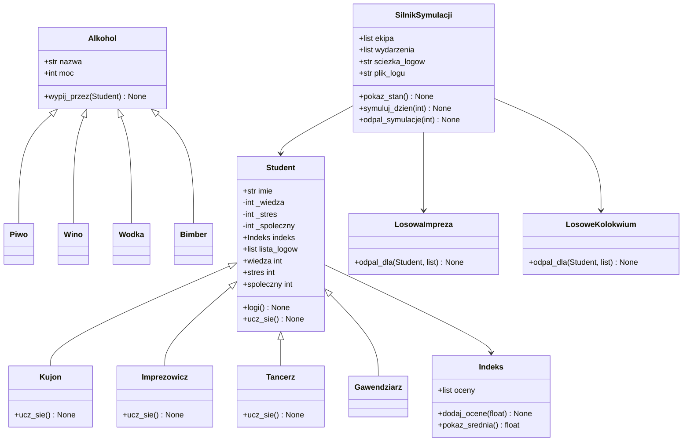

# Dokumentacja Projektu - Symulator Życia w Akademiku


## Skład Grupy
Piotr Wyrwiński - lider, programista, człowiek wielu talentów, filantrop, osoba nieszablonowa, wielowymiarowy, nieosiągalny dla bytów tego świata, skromny ale zarazem lubiący pokazać złoty perłowy pazur, kopalnia pomysłów

---

## 1. Temat Projektu
Symulator życia i nauki studentów w akademiku.

---

## 2. Opis Projektu 
Program symuluje codzienne życie studentów w akademiku przez określony czas (np. 30 dni). 

Każdy student ma imię, indeks na oceny oraz trzy statystyki o wartościach od 0 do 100:
1.  **Wiedza** – rośnie od nauki, spada na imprezach. Od wiedzy zależy ocena z kolokwium.
2.  **Stres** – rośnie od nauki i testów, spada od picia alkoholu.
3.  **Towarzyskość (spoleczny)** – rośnie od imprez, maleje przy samotnej nauce.

W symulacji mamy 4 typy studentów:
-   **Kujon** – uczy się najlepiej (+20 wiedzy), ale bardzo się stresuje i traci towarzyskość.
-   **Imprezowicz** – prawie się nie uczy, za to zyskuje mnóstwo punktów towarzyskich.
-   **Tancerz** – zrównoważony profil (trochę nauki, dużo towarzyskości).
-   **Gawendziarz** – standardowy student (wszystkie statystyki po +5).

### Przebieg dnia w akademiku:
Każdego dnia studenci albo się uczą, albo odpoczywają. Dodatkowo jest 50% szans, że wydarzy się coś losowego:
*   **Impreza** – studenci piją losowy alkohol (Piwo, Wino, Wódka lub Bimber). Alkohol obniża stres i podnosi towarzyskość, ale studenci tracą trochę wiedzy.
*   **Kolokwium** – studenci piszą test. Generuje to stres (+35). 
    *   Jeśli ostateczny stres wynosi 80 lub więcej, student może zaspać (50% szans) i dostać 2.
    *   Jeśli nie zaśpi, ma słabą ocenę (< 5) i jest towarzyski (towarzyskość >= 50), to próbuje ściągać od kogoś z wiedzą >= 40. Ma 70% szans na ściągnięcie (dostaje 4) i 30% szans na wpadkę (dostaje 2).
    *   W innym wypadku pisze sam i dostaje ocenę z wiedzy (5 za wiedzę >= 40, 3 za wiedzę >= 20, 2 poniżej 20).

Pod koniec każdego dnia program wypisuje logi do konsoli i dopisuje je do jednego pliku `logi.txt` w folderze `logi/data_godzina/`.

---

## 3. Diagramy UML

### a) Diagram Klas


### b) Diagram Sekwencji
```mermaid
@startuml
autonumber
actor Uzytkownik
participant "akademik.py" as Main
participant "symulator: SilnikSymulacji" as Silnik
participant "stud: Student" as Student
participant "wyd: LosoweKolokwium" as Event

Uzytkownik -> Main : Uruchomienie programu
Main -> Silnik : Inicjalizacja
Main -> Silnik : odpal_symulacje(3)

loop Kazdy dzien
    Silnik -> Silnik : symuluj_dzien(dzien)
    alt Dzisiaj nauka
        Silnik -> Student : ucz_sie()
    end
    alt Losowe wydarzenie (Kolokwium)
        Silnik -> Event : odpal_dla(stud, ekipa)
        Event -> Student : indeks.dodaj_ocene(ocena)
    end
    Silnik -> Silnik : Zapis logi.txt
end
@endum
```

### c) Diagram Maszyny Stanów
```mermaid
@startuml
[*] --> Inicjalizacja : Uruchomienie
Inicjalizacja --> SymulacjaDnia : Utworzenie silnika

state SymulacjaDnia {
    [*] --> WyborAktywnosci
    WyborAktywnosci --> Nauka : nauka
    WyborAktywnosci --> Odpoczynek : odpoczynek
    
    Nauka --> SprawdzenieWydarzenia
    Odpoczynek --> SprawdzenieWydarzenia
    
    state SprawdzenieWydarzenia {
        [*] --> BrakWydarzenia
        [*] --> Impreza : 50% szans
        [*] --> Kolokwium : 50% szans
        
        Kolokwium --> OcenaZaspania : Stres >= 80
        OcenaZaspania --> Zaspanie : 50% szans (ocena 2)
        OcenaZaspania --> PisanieTestu : 50% szans
        
        Kolokwium --> PisanieTestu : Stres < 80
        
        PisanieTestu --> Sciaganie : Towarzyszkosc >= 50, ocena < 5 i pomocnik obecny
        Sciaganie --> SukcesSciagania : 70% szans (ocena 4)
        Sciaganie --> Przylapanie : 30% szans (ocena 2)
        
        PisanieTestu --> PisanieSamodzielne : w przeciwnym razie
    }
    
    SprawdzenieWydarzenia --> Raportowanie : Zapis do logi.txt
    Raportowanie --> [*]
}

SymulacjaDnia --> SymulacjaDnia : Kolejny dzien
SymulacjaDnia --> [*] : Koniec dni
@endum
```

### d) diagram obiektów

```mermaid
@startuml
object "symulator : SilnikSymulacji" as silnik {
    sciezka_logow = "logi/data_godzina"
    plik_logu = "logi/data_godzina/logi.txt"
}

object "kujon : Kujon" as stud1 {
    imie = "Kujon"
    wiedza = 45
    stres = 15
    spoleczny = 28
}

object "imprezowicz : Imprezowicz" as stud2 {
    imie = "Imprezowicz"
    wiedza = 15
    stres = 5
    spoleczny = 45
}

object "indeks1 : Indeks" as ind1 {
    oceny = [5.0, 4.0]
}

object "indeks2 : Indeks" as ind2 {
    oceny = [2.0, 3.0]
}

silnik --> stud1 : ekipa[0]
silnik --> stud2 : ekipa[1]
stud1 --> ind1 : indeks
stud2 --> ind2 : indeks
@endum
@enduml
```

## 4. Główne Statystyki Studenta
Każdy student posiada trzy kluczowe atrybuty, które są automatycznie ograniczane (za pomocą dekoratora `@property`) do przedziału **[0, 100]**:
*   **Wiedza** (`wiedza`) – wzrasta podczas nauki, maleje podczas imprez. Wpływa na oceny z kolokwiów.
*   **Stres** (`stres`) – wzrasta podczas nauki i kolokwiów, maleje pod wpływem alkoholu.
*   **Towarzyskość** (`spoleczny`) – statystyka społeczna, zmienia się w zależności od typu studenta i spożywanych trunków.

---

## 5. Architektura i Struktura Plików

### 1. `akademik.py`
Punkt wejściowy programu. Odpowiada za zainicjalizowanie generatora liczb losowych oraz uruchomienie silnika symulacji na 30 dni.

### 2. `studenci.py`
Zawiera definicję klasy bazowej `Student` oraz jej wyspecjalizowanych podklas:
*   `Kujon` – uczy się najefektywniej (+20 wiedzy), ale kosztuje go to sporo stresu (+10) i traci na towarzyskości (-5).
*   `Imprezowicz` – nauka przychodzi mu ciężko (+2 wiedzy, +2 stresu), ale zyskuje ogromne punkty towarzyskie (+15).
*   `Tancerz` – uczy się umiarkowanie (+5 wiedzy, +1 stresu) i zyskuje towarzyskość (+10).
*   `Gawendziarz` – standardowy profil studenta (dziedziczy domyślne tempo nauki: +10 wiedzy, +5 stresu, +5 towarzyskości).

Klasa `Student` automatycznie dba o to, by atrybuty nie wykroczyły poza zakres `0-100`. Posiada listę `lista_logow` rejestrującą historię aktywności studenta z bieżącego dnia.

### 3. `indeks.py`
Klasa `Indeks` symuluje fizyczny indeks studenta. Przechowuje listę ocen oraz udostępnia metodę `pokaz_srednia()` wyliczającą średnią ocen (zwraca `0.0`, jeśli brak ocen).

### 4. `alkohole.py`
Klasa bazowa `Alkohol` oraz jej podklasy (`Piwo`, `Wino`, `Wodka`, `Bimber`). Każdy alkohol posiada swoją "moc" (w skali 1-5). Wypicie alkoholu przez studenta (`wypij_przez(stud)`) obniża jego stres i podnosi towarzyskość proporcjonalnie do mocy napoju.

### 5. `wydarzenia.py`
Definiuje losowe zdarzenia, które mogą przydarzyć się studentom w akademiku:
*   `LosowaImpreza` – studenci piją losowo wybrany alkohol (Piwo, Wino, Wódka, Bimber). Obniża to ich wiedzę, ale też zmniejsza stres i poprawia statystyki towarzyskie.
*   `LosoweKolokwium` – studenci piszą sprawdzian, co generuje stres (+35). Jeśli stres wynosi 80 lub więcej, istnieje 50% szans, że student zaśpi na kolokwium, co skutkuje automatycznym otrzymaniem oceny `2`. W przeciwnym razie, w zależności od poziomu wiedzy, otrzymuje:
    *   `5` (wiedza >= 40)
    *   `3` (wiedza >= 20)
    *   `2` (wiedza < 20)
    
    **Mechanika Ściągania (wykorzystanie statystyki Towarzyskości)**:
    Jeśli ocena studenta wynosi poniżej `5`, a jego towarzyskość (`spoleczny`) wynosi przynajmniej `50`, spróbuje on ściągać od innego obecnego studenta z wiedzą >= 40. Istnieje **70% szans na sukces** (ocena wzrasta do **4**) oraz **30% szans na przyłapanie** (ocena spada do **2**).

### 6. `silnik.py`
Klasa `SilnikSymulacji` kontroluje przebieg każdego dnia:
1.  Wylosowanie głównej aktywności na dany dzień: **nauka** lub **odpoczynek**.
2.  Wykonanie odpowiednich akcji dla każdego studenta w ekipie.
3.  Z szansą 50% wylosowanie i uruchomienie zdarzenia specjalnego (`LosowaImpreza` lub `LosoweKolokwium`).
4.  Wypisanie raportu ze stanem statystyk studentów na koniec dnia.
5.  Zapisanie oraz wyświetlenie logów w obrębie danego dnia. Logi są zapisywane w folderze `logi/` w podkatalogu z aktualną datą i godziną (np. `logi/2026-06-17_17-15-22/`), gdzie cała historia zapisywana jest w jednym pliku `logi.txt`.
